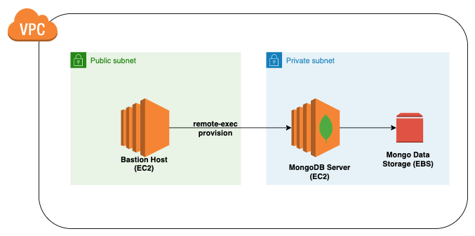
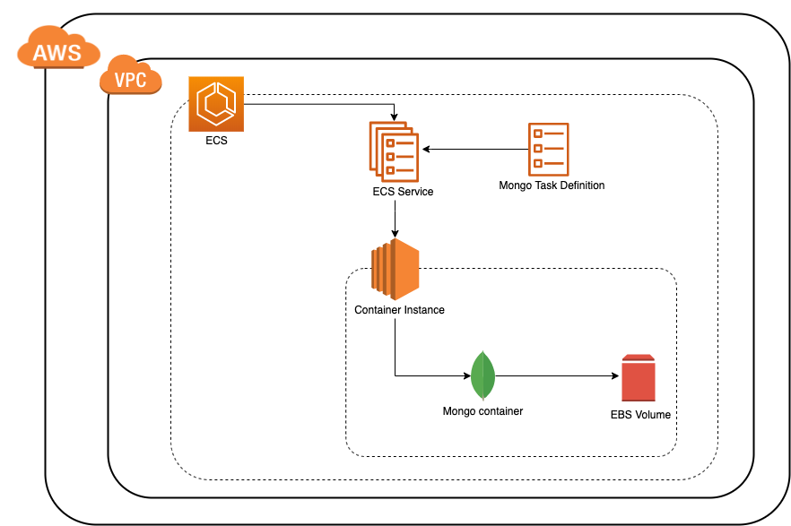

# Terraform MongoDB Provisioning
The purpose of the module is to simplify the process of provisioning MongoDB on AWS cloud using Terraform.
Here, we have listed our three different approaches to achieve that. Each approach has it's pros and cons.
Choose the right pick for your requirement.

## Approach 1: MongoDB Provisioning using EC2
This approach creates EC2 instance(s) and provision MongoDB using Ansible in the specified VPC and subnet. 
The mongodb data will be persisted in specified EBS volume. 
You can provision MongoDB server either in a public subnet or in a private subnet using Bastion host.

**Find out more about this approach [here](mongo-provisioner-ec2)**

## Approach 2: Mongo Provisioning using ECS

This approach creates an ECS task for mongo and runs/manages that task on EC2 instance of provided instance type. This mongo task
uses a docker plugin called `rexray/ebs` to provision and use EBS volume for persistent storage of mongo container. 

#### Pros:
1. Simplified mongo infra management with just Terraform
2. Mongo task gets restarted automatically in case of failure
3. Easy version upgrades with minimal downtime
4. Auto provision of EBS volume
5. Built-in ECS monitoring provided in ECS dashboard
6. Data volume will not be lost unless deleted manually.

#### Cons: 
1. Rolling deployments are not supported yet due to mongo single instance limitation.
2. EBS volume size should be chosen carefully because it is not possible to expand it later as it is managed by docker plugin

**Find out more about this approach [here](mongo-provisioner-ecs)**

## Approach 3: Mongo Provisioning using Packer and EC2
This approcah creates pre configured mongo AMIs using packer tool. 
Then it provisions the mongodb instances from pre configured AMIs in private subnet.

#### Pros:
1. It creates immutable infrastructure.
2. Easy version upgrades.
3. Minimal configuration needed for moving to other cloud providers.

##### Cons:
1. Maintaining the pre configured AMIs.

**Find out more about this approach [here](mongo-provisioner-packer)**

## Authors
>Talk to us `hi@everest.engineering`.

